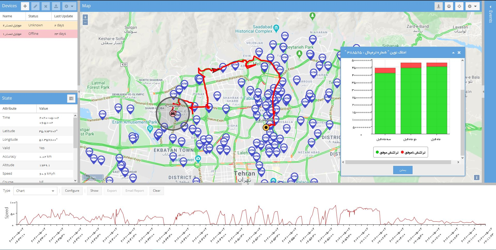

<div align="center">
  
  
  # 🚗 Traccar GPS Tracking System
  
  ### Professional Real-Time Vehicle Tracking & Fleet Management Platform
  
  [](http://217.172.120.2:8082/)
  [](LICENSE)
  [](https://www.sencha.com/products/extjs/)
  [](https://github.com/safarzadeh-reza/Traccar/stargazers)
  
  [Features](#-features) • [Demo](#-demo) • [Installation](#-installation) • [Usage](#-usage) • [Localization](#-localization) • [Contributing](#-contributing)
  
</div>

---

## 📖 Overview

**Traccar** is a powerful, open-source GPS tracking system designed for real-time vehicle monitoring, fleet management, and driver behavior analysis. Built with modern web technologies, it provides a comprehensive solution for businesses and individuals who need to track and manage multiple GPS devices efficiently.

### Why Choose Traccar?

- ✅ **Free & Open Source** - No licensing fees or hidden costs
- ✅ **Multi-Language Support** - Available in 40+ languages
- ✅ **Cross-Platform** - Works on any device with a web browser
- ✅ **Scalable** - From single vehicle to large fleets
- ✅ **Customizable** - Flexible and extensible architecture

---

## ✨ Features

<div align="center">

| 🗺️ Real-Time Tracking | 📊 Advanced Reporting | 🔔 Notifications |
|:---:|:---:|:---:|
| Track your vehicles in real-time on interactive maps | Generate detailed and summary reports | Get instant alerts via email and SMS |

| 🚧 Geofencing | 👤 User Management | 📱 Multi-Device Support |
|:---:|:---:|:---:|
| Create virtual boundaries and zones | Manage multiple users and permissions | Works on desktop, tablet, and mobile |

</div>

### Core Features

#### 🎯 Tracking & Monitoring
- **Real-time GPS tracking** with live map updates
- **Multiple map providers** support (OpenStreetMap, Google Maps, etc.)
- **Route history** and playback functionality
- **Device status monitoring** (online/offline, battery level, speed)
- **Distance calculation** and odometer tracking

#### 📈 Reports & Analytics
- **Detailed trip reports** with stops and routes
- **Summary reports** for daily/weekly/monthly analysis
- **Event logs** for all device activities
- **Driver behavior monitoring** (speeding, harsh braking, rapid acceleration)
- **Fuel consumption tracking** and analysis
- **Maintenance schedules** and reminders

#### 🔐 Security & Alerts
- **Geofencing** with entry/exit notifications
- **Speed limit alerts** and monitoring
- **Movement detection** alerts
- **Low battery warnings**
- **Device tampering detection**
- **Custom event notifications**

#### 👥 Management & Administration
- **Multi-user support** with role-based access control
- **Device grouping** and organization
- **Account management** dashboard
- **Custom attributes** and computed fields
- **Command sending** to devices
- **API access** for integrations

#### 📧 Communication
- **Email notifications** for events and alerts
- **SMS support** for critical notifications
- **Webhook integrations**
- **Custom notification templates**

---

## 🖼️ Screenshots

<div align="center">
  
  <p><em>Main Dashboard - Real-time vehicle tracking interface</em></p>
</div>

---

## 🎮 Demo

Experience Traccar live! Try our demo instance:

**🌐 Demo URL:** [http://217.172.120.2:8082/](http://217.172.120.2:8082/)

**📝 Demo Credentials:**
```
Username: Guest
Password: Guest
```

> **Note:** The demo instance is read-only. Some features may be limited for guest access.

---

## 🚀 Installation

### Prerequisites

Before installing Traccar, ensure you have:

- A web server (Apache, Nginx, or similar)
- PHP 7.0+ (for SMS functionality)
- Modern web browser (Chrome, Firefox, Safari, Edge)
- Traccar Server backend (download from [official site](https://www.traccar.org/))

### Quick Start

1. **Clone the repository:**
   ```bash
   git clone https://github.com/safarzadeh-reza/Traccar.git
   cd Traccar
   ```

2. **Configure your web server:**
   
   Point your web server's document root to the cloned directory.
   
   **Apache Example:**
   ```apache
   <VirtualHost *:80>
       ServerName traccar.yourdomain.com
       DocumentRoot /path/to/Traccar
       <Directory /path/to/Traccar>
           Options Indexes FollowSymLinks
           AllowOverride All
           Require all granted
       </Directory>
   </VirtualHost>
   ```

3. **Configure SMS (Optional):**
   
   Edit `sendsms.php` with your SMS provider credentials:
   ```php
   $param = array(
       'uname'=>'your_username',
       'pass'=>'your_password',
       'from'=>'your_sender_id',
       // ... other settings
   );
   ```

4. **Access the application:**
   
   Open your browser and navigate to:
   ```
   http://traccar.yourdomain.com/debug.html (development)
   http://traccar.yourdomain.com/release.html (production)
   ```

### Docker Installation (Recommended)

For easier deployment, consider using Docker:

```bash
# Pull and run Traccar server
docker pull traccar/traccar:latest
docker run -d --name traccar -p 8082:8082 traccar/traccar:latest

# Serve the web interface
docker run -d --name traccar-web -p 80:80 -v $(pwd):/usr/share/nginx/html nginx:alpine
```

---

## 📚 Usage

### Basic Workflow

1. **Login** to the system using your credentials
2. **Add devices** by entering device identifiers
3. **Configure settings** for each device (name, group, attributes)
4. **Set up geofences** for areas of interest
5. **Create notifications** for important events
6. **Monitor** your devices in real-time on the map
7. **Generate reports** for analysis and record-keeping

### Key Actions

#### Adding a Device
1. Click on the **Devices** menu
2. Select **Add Device** (+ icon)
3. Enter device details:
   - Name
   - Unique identifier
   - Device group (optional)
   - Additional attributes
4. Save and start tracking

#### Creating Geofences
1. Go to **Geofences** section
2. Click **Add Geofence**
3. Draw the area on the map (circle or polygon)
4. Name the geofence
5. Configure entry/exit notifications

#### Setting Up Notifications
1. Navigate to **Notifications**
2. Choose event type (speed limit, geofence, etc.)
3. Select notification method (email, SMS, web)
4. Assign to specific devices or groups

#### Generating Reports
1. Click on **Reports** menu
2. Select report type:
   - **Route** - Complete travel history
   - **Events** - All triggered events
   - **Trips** - Journey summaries with stops
   - **Stops** - Detailed stop information
   - **Summary** - Overview statistics
3. Set date range and devices
4. Click **Show** to generate

---

## 🏗️ Architecture & Technology Stack

### Frontend Technologies
- **ExtJS Framework** - Enterprise JavaScript framework for building web applications
- **OpenLayers** - Interactive mapping library
- **HTML5/CSS3** - Modern web standards
- **JavaScript (ES5/ES6)** - Core programming language

### Backend Integration
- **RESTful API** - Communication with Traccar server
- **WebSocket** - Real-time updates
- **AJAX** - Asynchronous data loading

### File Structure
```
Traccar/
├── app/                    # Application source code
│   ├── controller/        # ExtJS controllers
│   ├── model/            # Data models
│   ├── store/            # Data stores
│   └── view/             # UI components
├── css/                   # Stylesheets
├── images/               # Images and icons
├── js/                   # JavaScript libraries
├── l10n/                 # Localization files (40+ languages)
├── app.js                # Main application file
├── debug.html            # Development entry point
├── release.html          # Production entry point
└── README.md             # This file
```

---

## 🌍 Localization

Traccar supports **40+ languages** out of the box! The system automatically detects your browser language and displays the interface accordingly.

### Supported Languages

<details>
<summary><b>Click to view all supported languages</b></summary>

| Language | Code | Language | Code |
|----------|------|----------|------|
| 🇸🇦 Arabic | ar | 🇮🇩 Indonesian | id |
| 🇦🇿 Azerbaijani | az | 🇮🇹 Italian | it |
| 🇧🇬 Bulgarian | bg | 🇯🇵 Japanese | ja |
| 🇧🇩 Bengali | bn | 🇰🇷 Korean | ko |
| 🇨🇿 Czech | cs | 🇱🇹 Lithuanian | lt |
| 🇩🇰 Danish | da | 🇱🇻 Latvian | lv |
| 🇩🇪 German | de | 🇲🇾 Malay | ms |
| 🇬🇷 Greek | el | 🇳🇱 Dutch | nl |
| 🇬🇧 English | en | 🇳🇴 Norwegian | no |
| 🇪🇸 Spanish | es | 🇵🇱 Polish | pl |
| 🇮🇷 Persian | fa | 🇵🇹 Portuguese | pt |
| 🇫🇮 Finnish | fi | 🇧🇷 Portuguese (BR) | pt_BR |
| 🇫🇷 French | fr | 🇷🇴 Romanian | ro |
| 🇮🇱 Hebrew | he | 🇷🇺 Russian | ru |
| 🇮🇳 Hindi | hi | 🇸🇰 Slovak | sk |
| 🇭🇷 Croatian | hr | 🇸🇮 Slovenian | sl |
| 🇭🇺 Hungarian | hu | 🇷🇸 Serbian | sr |
| And many more... | | | |

</details>

### Adding a New Language

1. Create a new JSON file in the `l10n/` directory (e.g., `xx.json`)
2. Copy the structure from `en.json`
3. Translate all strings
4. Submit a pull request

---

## 🔌 API Integration

Traccar provides a comprehensive REST API for custom integrations:

### Authentication
```javascript
// Login
POST /api/session
{
  "email": "user@example.com",
  "password": "password"
}
```

### Get Devices
```javascript
// Get all devices
GET /api/devices

// Get specific device
GET /api/devices/{id}
```

### Get Positions
```javascript
// Get latest positions
GET /api/positions

// Get position history
GET /api/positions?deviceId={id}&from={timestamp}&to={timestamp}
```

### Send Commands
```javascript
// Send command to device
POST /api/commands/send
{
  "deviceId": 1,
  "type": "positionPeriodic",
  "attributes": {
    "frequency": 300
  }
}
```

For complete API documentation, visit the [Traccar API Documentation](https://www.traccar.org/api-reference/).

---

## 🛠️ Troubleshooting

### Common Issues

#### Issue: Devices not showing on map
**Solution:**
- Check if Traccar server is running
- Verify device configuration and unique identifier
- Check network connectivity
- Review server logs for errors

#### Issue: SMS notifications not working
**Solution:**
- Verify SMS provider credentials in `sendsms.php`
- Check PHP configuration and curl extension
- Test SMS API separately
- Review error logs

#### Issue: Map not loading
**Solution:**
- Check internet connection
- Verify map provider settings
- Clear browser cache
- Check browser console for errors

#### Issue: Slow performance
**Solution:**
- Reduce number of devices on screen
- Increase server resources
- Optimize database queries
- Use production build (`release.html`)

### Getting Help

- 📖 **Documentation:** [Traccar Official Docs](https://www.traccar.org/documentation/)
- 💬 **Community Forum:** [Traccar Forums](https://www.traccar.org/forums/)
- 🐛 **Issues:** [GitHub Issues](https://github.com/safarzadeh-reza/Traccar/issues)

---

## 🤝 Contributing

We welcome contributions from the community! Here's how you can help:

### Ways to Contribute

1. 🐛 **Report Bugs** - Found a bug? Open an issue
2. 💡 **Suggest Features** - Have an idea? We'd love to hear it
3. 🔧 **Submit Pull Requests** - Fix bugs or add features
4. 📚 **Improve Documentation** - Help others understand the project
5. 🌍 **Translate** - Add or improve language translations

### Development Workflow

1. **Fork** the repository
2. **Clone** your fork:
   ```bash
   git clone https://github.com/YOUR_USERNAME/Traccar.git
   ```
3. **Create a branch:**
   ```bash
   git checkout -b feature/your-feature-name
   ```
4. **Make changes** and test thoroughly
5. **Commit** with clear messages:
   ```bash
   git commit -m "Add: Description of your changes"
   ```
6. **Push** to your fork:
   ```bash
   git push origin feature/your-feature-name
   ```
7. **Create a Pull Request** on GitHub

### Code Style Guidelines

- Follow existing code formatting
- Use meaningful variable and function names
- Comment complex logic
- Test your changes before submitting
- Update documentation if needed

---

## 📄 License

This project is licensed under the **GNU General Public License v3.0** - see the [LICENSE](LICENSE) file for details.

```
Copyright © 2015 Anton Tananaev (anton@traccar.org)
Copyright © 2026 Reza Safarzadeh

This program is free software: you can redistribute it and/or modify
it under the terms of the GNU General Public License as published by
the Free Software Foundation, either version 3 of the License, or
(at your option) any later version.
```

---

## 🙏 Acknowledgments

- **[Traccar](https://www.traccar.org/)** - Original GPS tracking platform
- **[OpenStreetMap](https://www.openstreetmap.org/)** - Map data provider
- **[ExtJS](https://www.sencha.com/products/extjs/)** - JavaScript framework
- **[OpenLayers](https://openlayers.org/)** - Mapping library
- All contributors who have helped improve this project

---

## 📞 Contact & Support

- **Developer:** Reza Safarzadeh
- **GitHub:** [@safarzadeh-reza](https://github.com/safarzadeh-reza)
- **Repository:** [github.com/safarzadeh-reza/Traccar](https://github.com/safarzadeh-reza/Traccar)

---

## ⭐ Show Your Support

If you find this project helpful, please consider:

- ⭐ **Star** this repository
- 🍴 **Fork** it for your own use
- 📢 **Share** it with others
- 🐛 **Report** bugs or issues
- 💬 **Contribute** to the codebase

---

<div align="center">
  
  **Made with ❤️ by the Traccar Community**
  
  [⬆ Back to Top](#-traccar-gps-tracking-system)
  
</div>
